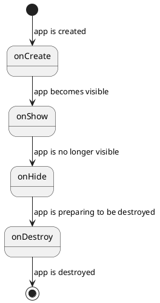

# App Fundamentals

Let's start with some notable behaviours:
- Apps have a ledger that describes them: this is the `AppManifest`, which is found at `tt::app::AppManifest`.
- Apps can be created and destroyed. You can call `tt::app::start()` to start an app.
- Apps can be shown and hidden: when they are ready to render their UI, or when their UI is hidden. If an app starts another app, the original app is temporarily hidden, until the second app is destroyed.
- Apps can start other apps. An app can return a result to the app that started it.
- Apps can be started with parameters.

## Internal or external

There are 2 distinct types of apps:

**Internal apps** ([example](https://github.com/ByteWelder/Tactility/blob/{{versionLabel}}/App/Source/HelloWorld/HelloWorld.cpp))

These are inside the Tactility project and use a C++ API. They have full access to the internal Tactility APIs.
Internal apps can run on the simulator and on ESP32.

**External apps** ([example](https://github.com/ByteWelder/Tactility/blob/{{versionLabel}}/ExternalApps/HelloWorld/main/Source/main.c))

These apps have their own _elf_ binary and can be stored and launched from a filesystem.
External apps are built on top of TactilitySDK. TactilitySDK only exposes a limited set of
functionality and is an API written in C.

External apps currently only run on ESP32 and are not yet supported by the simulator.

## Lifecycle

An app goes through these states:



Let's look at a scenario where an app launches another app:

1. `first` app starts: `first.onCreate()` -> `first.onShow()`
2. `second` app starts: `first.onHide()` -> `second.onCreate()` -> `second.onShow()`
3. `second` app exits: `second.onHide()` -> `second.onDestroy()` -> `first.onShow()`
4. `first` app exits: `first.onHide()` -> `first.onDestroy()`

## Registering new apps

Apps must declare a manifest. The manifest specifies the app identifier, the human-readable name,
where the class or functions of the app are and more.
The app manifest is then registered, so the apps can be launched (e.g. from the Launcher app or other apps)

<!-- tabs:start -->

#### **Tactility**

Internal apps are specified in the `tt::Configuration` such as [here](https://github.com/ByteWelder/Tactility/blob/{{versionLabel}}/App/Source/Main.cpp).

They are automatically added to the internal app registry.

#### **TactilitySDK**

External apps must manually register their manifest:

```c
ExternalAppManifest manifest = {
    .name = "Hello World",
    .onShow = onShow
};

int main(int argc, char* argv[]) {
    tt_app_register(&manifest);
    return 0;
}
```

<!-- tabs:end -->

## Showing a user interface

Interfaces are created with [lvgl](https://github.com/lvgl/lvgl) which has lots of [widgets](https://docs.lvgl.io/9.0/widgets/index.html)!
Creating a touch-capable UI is [easy](https://docs.lvgl.io/9.0/get-started/quick-overview.html).

When the application's `onCreate()` function is called, you get access to `lv_obj_t* parent`.
This parent is the root widget that is used to attach other widgets too.
It's the root of the application's window.

<!-- tabs:start -->

#### **Tactility**

```cpp
void onShow(AppContext& context, lv_obj_t* parent) override {
    lv_obj_t* toolbar = tt::lvgl::toolbar_create(parent, context);
    lv_obj_align(toolbar, LV_ALIGN_TOP_MID, 0, 0);

    lv_obj_t* label = lv_label_create(parent);
    lv_label_set_text(label, "Hello, world!");
    lv_obj_align(label, LV_ALIGN_CENTER, 0, 0);
}
```

#### **TactilitySDK**

```c
static void onShow(AppHandle app, void* data, lv_obj_t* parent) {
    lv_obj_t* toolbar = tt_lvgl_toolbar_create(parent, app);
    lv_obj_align(toolbar, LV_ALIGN_TOP_MID, 0, 0);

    lv_obj_t* label = lv_label_create(parent);
    lv_label_set_text(label, "Hello, world!");
    lv_obj_align(label, LV_ALIGN_CENTER, 0, 0);
}
```

<!-- tabs:end -->

## Starting app with parameters

<!-- tabs:start -->

#### **Tactility**

There are generally 2 ways to start an app with parameters:
- By calling `void tt::app::start(string appId, Bundle parameters)`
- By calling an app-specific function, like `void tt::app::textviewer::start(string filepath)`

When apps require parameters, it's desirable to have an app-specific function that takes care of calling `tt::app::start()`.
This way, the caller doesn't have to know about the internal formatting of the `Bundle`.

#### **TactilitySDK**

TactilitySDK has the following functions via `tt_app.h`:
- `void tt_app_start(const char* appId)`
- `void tt_app_start_with_bundle(string id, BundleHandle parameters)`

<!-- tabs:end -->

## App results

Some applications report back with a success/failure result, and some might even return data.

When an application is expected to do an operation, it might want to report that back.

Let's take the `SelectionDialog` app as example: it is started with a list of items to select, and when it finishes
it can report back which item was selected by setting the item index in the result bundle.

## Receive a result from an app

The application that launched the result-setting application is the one that receives the result.

<!-- tabs:start -->

#### **Tactility**

The launching application will have `App::onResult()` called right after `App::onShow()` when it resumes operation.

#### **TactilitySDK**

The launching application will have `ExternalAppManifest::onResult` called right after `ExternalAppManifest::onShow` when it resumes operation.

<!-- tabs:end -->

## Return a result to an app

<!-- tabs:start -->

#### **Tactility**

The `App` class has these methods:
- `void setResult(Result, std::unique_ptr<Bundle>)`
- `bool hasResult()`

They can be called at any time, but after `App::onDestroy()` is called, any calls to `setResult()` won't have an effect.

#### **TactilitySDK**

TactilityC has these functions related to `AppHandle`:
- `void tt_app_set_result(AppHandle, Result, BundleHandle)`
- `bool tt_app_has_result(AppHandle)`

They can be called at any time, but after `ExternalManifest::onDestroy` is called, any calls to `tt_app_context_set_result()` won't have an effect.

<!-- tabs:end -->

