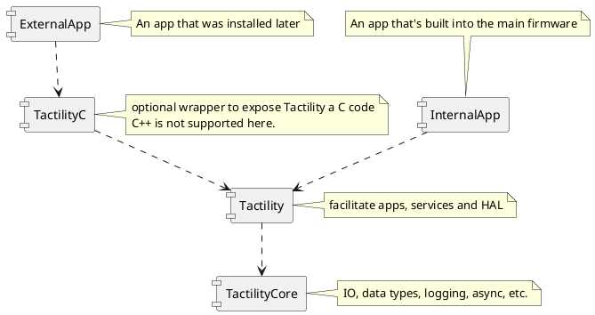

# Project Structure

- `Boards`: Contains board configuration projects with drivers (and simulator)
- `Firmware`: The application/firmware example project
- `Libraries`: Contains a mix of regular libraries and ESP modules
- `Tactility`: The main application platform code
- `TactilityC`: C wrappers for making side-loaded apps (C++ is not supported yet)
- `TactilityCore`: Core functionality regarding threads, stdlib, etc.

