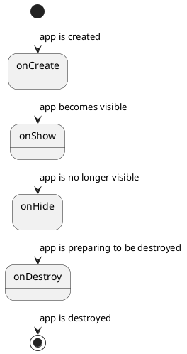

# App Development - Fundamentals

Note that this guide is for developing external apps (`.app` files). Those are apps that you install after flashing the main operating system.

Functions and variables in an app's `.elf` file are referred to as "symbols". When you build an app, it contains all the symbols
of that app itself, but you're likely also using external dependencies such as libc or LVGL.

The app refers to these symbols, but they don't actually exist inside its binary. When the app is loaded onto a device, a Tactility subsystem maps these symbols from the main firmware into the app. This mechanism is comparable to attaching a dynamically linked library where Tactility is the one facilitating the "library" functions.

## Device Firmware

The device firmware contains the main operating system, including symbol mappings for apps:

It exposes a limited set of functions to the apps. It stores a map that ties a function pointer to a function name. Function names are stripped by the ESP-IDF build system, so we have to manually map them. This mapping is defined in `tt_init.cpp` and is hard-wired into the firmware.

## TactilitySDK

TactilitySDK exposes symbol interfaces/names to the apps:

It includes headers for TactilityC, LVGL and more. It exposes Tactility/LVGL/libc functionality to apps. Linking with the app happens dynamically, so its symbols are not embedded statically into the app.

## Apps

Apps have an `.app` file extension. This is a tar file that contains:
- The application "manifest": this is a ledger with relevant metadata, such as the app version.
- One or more ELF binaries: the binary executable file
- An optional `assets/` folder

App executables only contain the symbols defined by its own source files. All other symbols must be present in the main firmware **and** exposed explicitly by `tt_init.cpp` in `TactilityC`

Some notable behaviours:
- Apps can be created and destroyed. You can call `tt_app_start()` to start an app.
- Apps can be shown and hidden: when they are ready to render their UI, or when their UI is hidden. If an app starts another app, the original one is temporarily hidden, until the second app is destroyed.
- Apps can start other apps. An app can return a result to the app that started it.
- Apps can be started with parameters.

## Lifecycle

An app goes through these states:



Let's look at a scenario where an app launches another app:

1. `first` app starts: `first.onCreate()` -> `first.onShow()`
2. `second` app starts: `first.onHide()` -> `second.onCreate()` -> `second.onShow()`
3. `second` app exits: `second.onHide()` -> `second.onDestroy()` -> `first.onShow()`
4. `first` app exits: `first.onHide()` -> `first.onDestroy()`

## Registering new apps

Apps must declare a manifest. The manifest contains everything that is needed to create and run the application.
The app manifest is then registered, so the apps can be launched (e.g. from the Launcher app or other apps)

```c
void onShowApp(AppHandle handle, void* data, lv_obj_t* parent) {
    // Create some widgets
}

int main(int argc, char* argv[]) {
    tt_app_register((AppRegistration) {
        .onShow = onShowApp
    });
    return 0;
}
```

## Manifest.properties

The `manifest.properties` file contains metadata. Example:

```properties
[manifest]
version=0.1
[target]
sdk=0.6.0-SNAPSHOT10
platforms=esp32,esp32s3
[app]
id=one.tactility.helloworld
versionName=0.1.0
versionCode=1
name=Hello World
```

## Showing a user interface

Interfaces are created with [lvgl](https://github.com/lvgl/lvgl) which has lots of [widgets](https://docs.lvgl.io/9.3/widgets/index.html)!
Creating a touch-capable UI is [easy](https://docs.lvgl.io/9.3/get-started/quick-overview.html).

When the application's `onShow()` function is called, you get access to `lv_obj_t* parent`.
This parent is the root widget that is used to attach other widgets too.
It's the root of the application's window.

```c
static void onShowApp(AppHandle appHandle, void* data, lv_obj_t* parent) {
    lv_obj_t* toolbar = tt_lvgl_toolbar_create_for_app(parent, appHandle);
    lv_obj_align(toolbar, LV_ALIGN_TOP_MID, 0, 0);

    lv_obj_t* label = lv_label_create(parent);
    lv_label_set_text(label, "Hello, world!");
    lv_obj_align(label, LV_ALIGN_CENTER, 0, 0);
}
```

## Starting app with parameters

TactilitySDK has the following functions via `tt_app.h`:
- `void tt_app_start(const char* appId)`
- `void tt_app_start_with_bundle(string id, BundleHandle parameters)`

## App results

Some applications report back with a success/failure result, and some might even return data.

When an application is expected to do an operation, it might want to report that back.

## Receive a result from an app

The application that launched the result-setting application is the one that receives the result.

The launching application will have its `onResult()` function called right after `onShow()` when it resumes operation.

## Return a result to an app

TactilityC has these functions related to `AppHandle`:
- `void tt_app_set_result(AppHandle, Result, BundleHandle)`
- `bool tt_app_has_result(AppHandle)`

They can be called at any time, but after `App::onDestroy` is called, any calls to `tt_app_context_set_result()` won't have an effect.

## Assets

The application may have an optional `assets/` folder in its project root path.
This folder gets packaged with the application.

Keep in mind that the total path length of any file is limited to 255 characters, including the root path such as `/sdcard`.

You can access its files via `tt_app_get_assets_child_path()`, for example:

```c
// Fetch the path (255 chars + terminator is the path size limit)
char path[256];
size_t size = 256;
tt_app_get_assets_child_path(handle, "file.txt", path, &size);

// Validate if we got the path
if (size == 0) {
    ESP_LOGE(TAG, "Failed to get assets path");
    return "";
}

// We must lock file access, because some filesystems are on
// a shared bus such as SPI, which is shared with the display.
// File access is mutually exclusive with other devices on that bus.
auto lock = tt_lock_alloc_for_file(path);
if (tt_lock_acquire(lock, TT_MAX_TICKS)) {
    FILE* file = fopen(path, "r");
    if (file != nullptr) {
        // fread()
        fclose(file);
    }
    tt_lock_release(lock);
}
tt_lock_free(lock);
```

