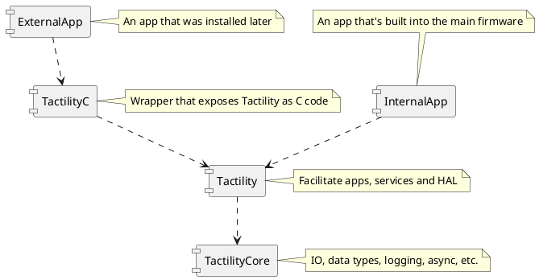

# Project Structure

- `Boards`: Board implementation projects
- `Drivers`: Core drivers, Tactility drivers
- `Firmware`: The main project to build the firmware (and simulator)
- `Libraries`: A mix of regular libraries and ESP components
- `Tactility`: The main application platform
- `TactilityC`: C wrappers for Tactility used by external apps
- `TactilityCore`: Core functionality (e.g. IO, multi-tasking, logging, etc.)

